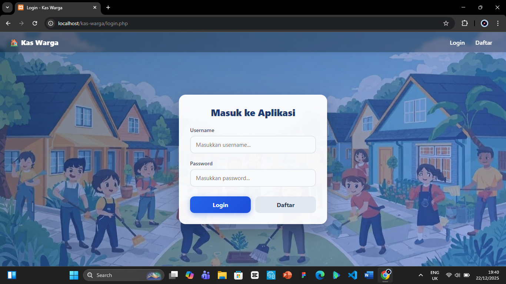
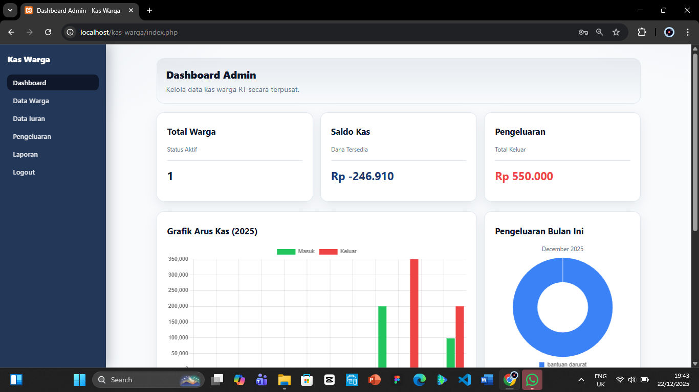
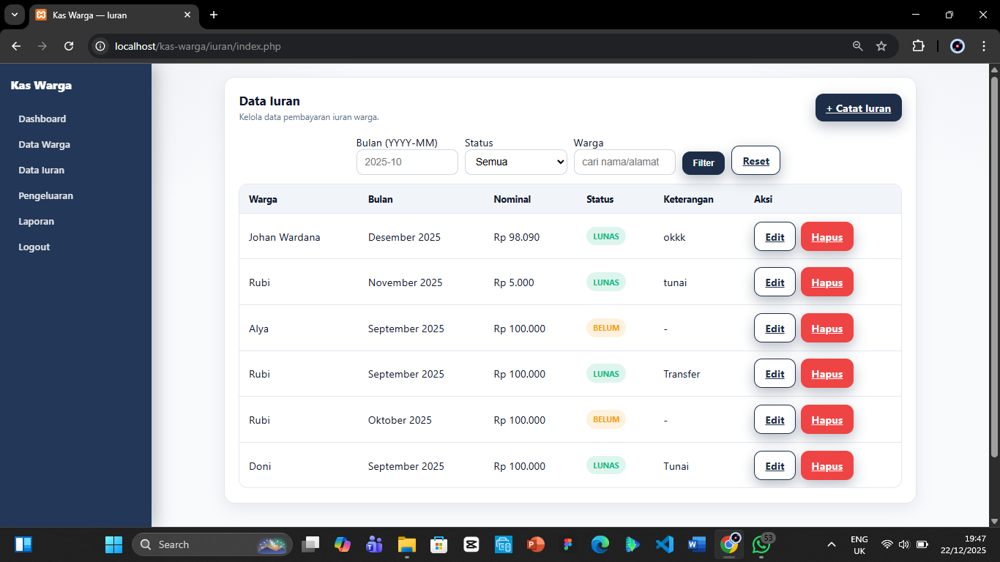
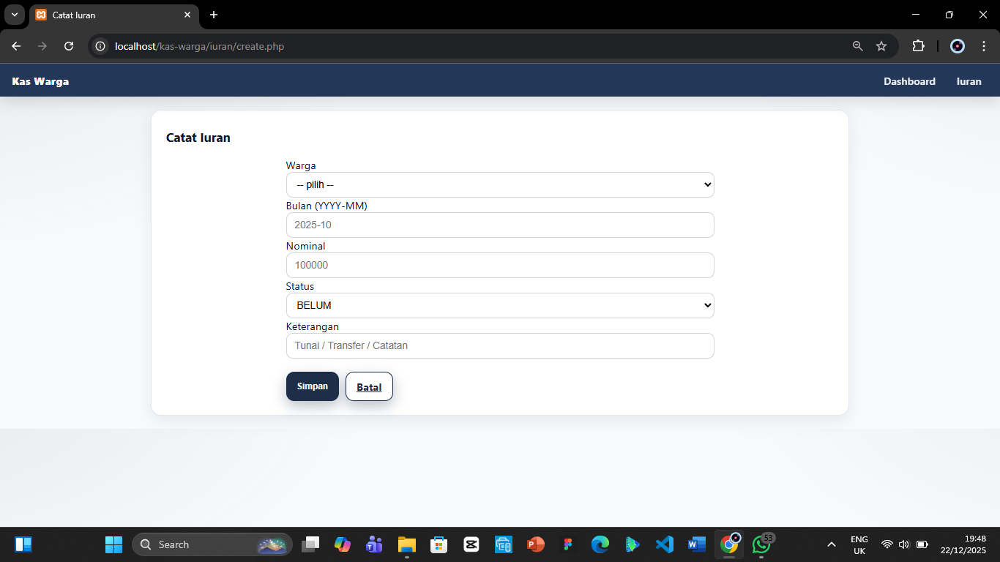
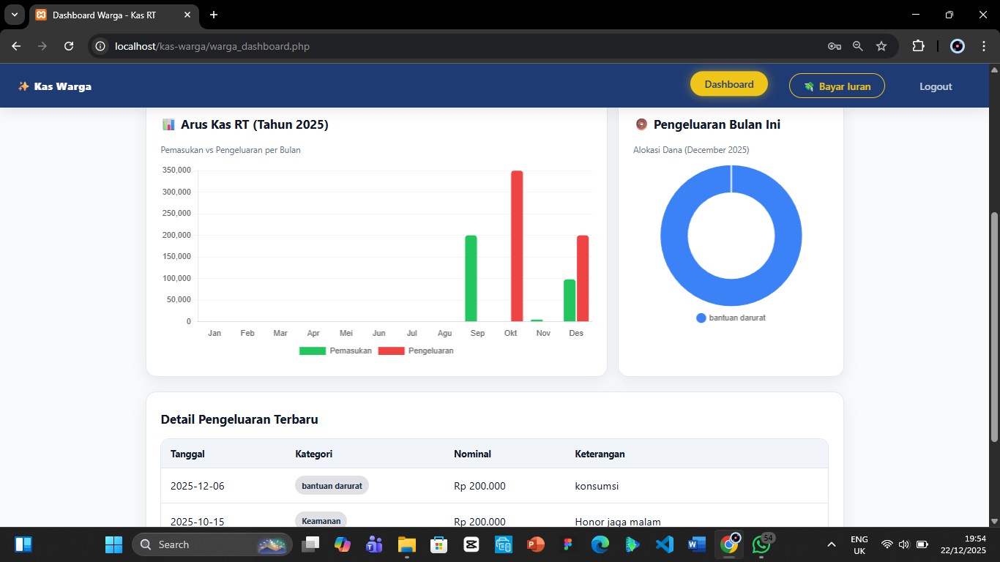
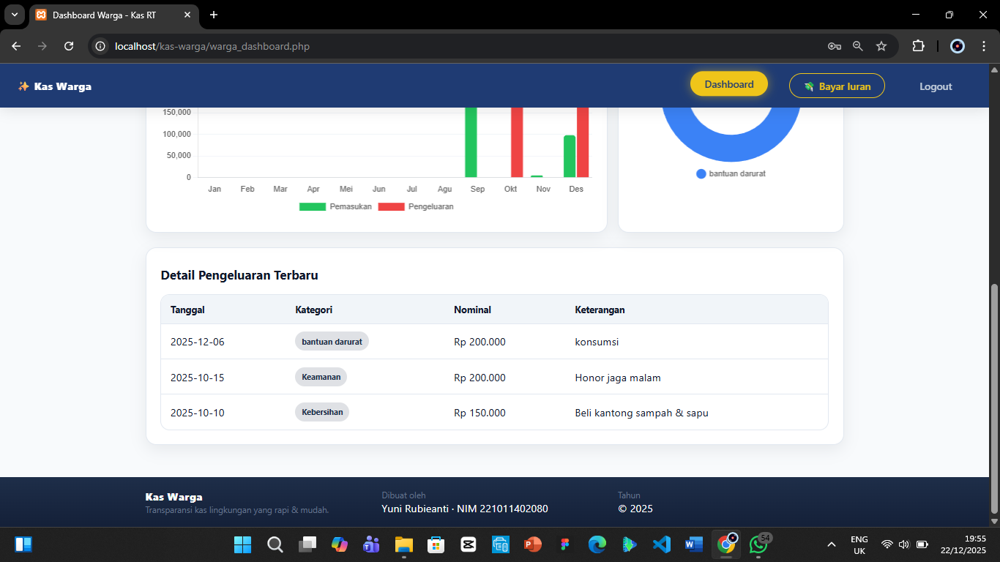

# 💰 Kas Warga - Sistem Pengelolaan Kas RT

Aplikasi web sederhana untuk mengelola kas warga di tingkat RT/RW. Dibangun menggunakan **PHP Native** dengan database **MySQL**. Aplikasi ini mendukung dua jenis pengguna: **Admin** dan **Warga**.

---

## 📋 Deskripsi Tugas

Proyek ini merupakan sistem informasi untuk membantu pengelolaan keuangan di tingkat RT/RW. Sistem ini memungkinkan:

- Admin untuk mengelola data warga, mencatat iuran, pengeluaran, dan membuat laporan
- Warga untuk melihat riwayat iuran dan melakukan pembayaran secara mandiri

---

## ✨ Fitur Aplikasi

### 1. Login & Register

Sistem autentikasi untuk Admin dan Warga.

| Login                   | Register                    |
| ----------------------- | --------------------------- |
|  |  |

- **Login**: Halaman login untuk admin dan warga dengan form username/email dan password.
- **Register**: Halaman pendaftaran warga baru dengan input nama, alamat, no HP, dan password.

---

### 2. Dashboard Admin

Halaman utama admin dengan ringkasan kas masuk, kas keluar, total warga, dan grafik arus kas.


_Tampilan header dashboard dengan ringkasan total warga, kas masuk, dan kas keluar._


_Grafik arus kas bulanan dan tabel transaksi terbaru._

---

### 3. Manajemen Data Warga

Admin dapat melihat, menambah, mengedit, dan menghapus data warga.


_Tabel daftar semua warga dengan opsi edit dan hapus._


_Form untuk menambahkan data warga baru secara manual oleh admin._

---

### 4. Manajemen Iuran

Admin dapat melihat daftar iuran warga dan menambahkan catatan iuran secara manual.


_Daftar iuran semua warga dengan status pembayaran (Lunas/Belum/Menunggu)._


_Form untuk mencatat pembayaran iuran secara manual oleh admin._

---

### 5. Manajemen Pengeluaran

Admin dapat mencatat dan mengelola pengeluaran kas RT.


_Daftar pengeluaran kas RT dengan keterangan dan nominal._


_Form untuk menambahkan catatan pengeluaran baru._

---

### 6. Laporan Keuangan

Admin dapat melihat laporan keuangan bulanan atau tahunan dan mengekspor ke CSV.


_Halaman laporan dengan filter periode (bulanan/tahunan) dan tombol export CSV._

---

### 7. Dashboard Warga

Halaman utama untuk warga dengan informasi iuran dan riwayat pembayaran.


_Header dashboard warga dengan informasi profil dan ringkasan iuran._


_Riwayat pembayaran iuran warga._


_Daftar tagihan iuran yang belum dibayar._

---

### 8. Pembayaran Iuran Warga

Warga dapat melakukan pembayaran iuran secara mandiri dengan upload bukti pembayaran.


_Form pembayaran iuran dengan upload bukti transfer untuk konfirmasi admin._

---

## 📁 Struktur File

```
kas-warga/
├── assets/                 # CSS & JavaScript
│   ├── style.css           # Stylesheet utama
│   └── app.js              # JavaScript utama
│
├── config/                 # Konfigurasi
│   ├── db.php              # Koneksi database
│   └── functions.php       # Helper functions
│
├── iuran/                  # CRUD Iuran
│   ├── index.php           # Daftar iuran
│   ├── create.php          # Tambah iuran
│   ├── edit.php            # Edit iuran
│   ├── delete.php          # Hapus iuran
│   └── bayar.php           # Proses pembayaran
│
├── laporan/                # Laporan Keuangan
│   ├── index.php           # Halaman laporan
│   └── export_csv.php      # Export ke CSV
│
├── pengeluaran/            # CRUD Pengeluaran
│   ├── index.php           # Daftar pengeluaran
│   ├── create.php          # Tambah pengeluaran
│   ├── edit.php            # Edit pengeluaran
│   └── delete.php          # Hapus pengeluaran
│
├── warga/                  # CRUD Warga
│   ├── index.php           # Daftar warga
│   ├── create.php          # Tambah warga
│   ├── edit.php            # Edit warga
│   └── delete.php          # Hapus warga
│
├── partials/               # Komponen Reusable
│   ├── sidebar_admin.php   # Sidebar admin
│   ├── footer.php          # Footer
│   └── layout_admin_*.php  # Layout admin
│
├── img/                    # Gambar/Screenshot
├── pict/                   # Upload gambar bukti bayar
│
├── index.php               # Dashboard Admin
├── warga_dashboard.php     # Dashboard Warga
├── login.php               # Halaman login
├── register.php            # Halaman register
├── logout.php              # Proses logout
├── bayar.php               # Halaman pembayaran warga
├── database.sql            # Script database
└── README.md               # Dokumentasi
```

---

## 🚀 Cara Penggunaan

### Prasyarat

- **XAMPP** atau web server dengan PHP 7.4+
- **MySQL / MariaDB**
- Browser modern (Chrome, Firefox, Edge)

### Langkah Instalasi

1. **Clone atau download** proyek ini ke folder `htdocs`:

   ```bash
   git clone [repository-url] xampp/htdocs/kas-warga
   ```

2. **Import database**:

   - Buka **phpMyAdmin** (http://localhost/phpmyadmin)
   - Buat database baru bernama `kas_warga`
   - Import file `database.sql`

   Atau jalankan via terminal:

   ```bash
   mysql -u root -p < database.sql
   ```

3. **Konfigurasi database**:

   - Buka file `config/db.php`
   - Sesuaikan kredensial database jika diperlukan:

   ```php
   $host = 'localhost';
   $user = 'root';
   $pass = '';
   $db   = 'kas_warga';
   ```

4. **Jalankan aplikasi**:
   - Start Apache dan MySQL di XAMPP
   - Buka browser: `http://localhost/kas-warga`

### Akun Default

| Role  | Cara Akses                                 |
| ----- | ------------------------------------------ |
| Admin | Register sebagai admin atau login langsung |
| Warga | Register via halaman register              |

---

## 🗃️ Database Schema

### Tabel `warga`

| Column     | Type         | Description  |
| ---------- | ------------ | ------------ |
| id         | INT          | Primary Key  |
| nama       | VARCHAR(100) | Nama warga   |
| alamat     | VARCHAR(200) | Alamat warga |
| no_hp      | VARCHAR(30)  | Nomor HP     |
| created_at | TIMESTAMP    | Waktu dibuat |

### Tabel `iuran`

| Column     | Type         | Description          |
| ---------- | ------------ | -------------------- |
| id         | INT          | Primary Key          |
| warga_id   | INT          | Foreign Key ke warga |
| bulan      | CHAR(7)      | Format: YYYY-MM      |
| nominal    | INT          | Jumlah iuran         |
| status     | ENUM         | LUNAS/BELUM/MENUNGGU |
| keterangan | VARCHAR(255) | Catatan              |
| created_at | TIMESTAMP    | Waktu dibuat         |

---

## 👨‍💻 Teknologi yang Digunakan

- **PHP Native** - Backend
- **MySQL** - Database
- **HTML/CSS** - Frontend
- **JavaScript** - Interaktivitas
- **Chart.js** - Grafik

---

## 📝 Lisensi

Proyek ini dibuat untuk tujuan pembelajaran.
